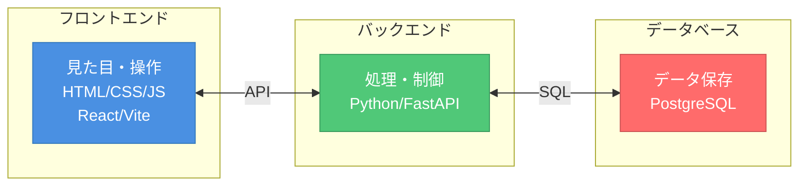
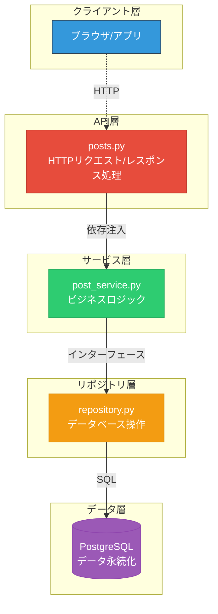
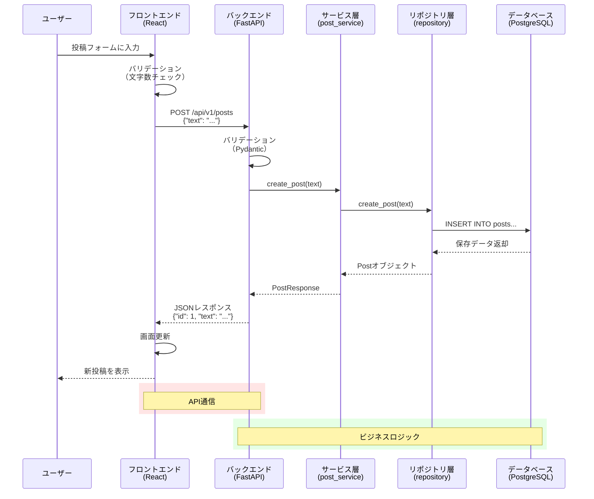
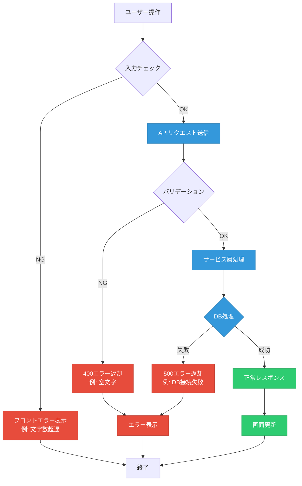

# Web開発入門講座 - アプリ開発を通じて学ぶ現代的な開発手法

> **対象**: プログラミング経験3ヶ月、アプリ開発未経験の大学1年生  
> **時間**: 2.5時間  
> **目標**: フロントエンド・バックエンド・API・DB・SQLの基本概念を実践的に理解する

---

## 📚 講座の流れ

1. **Web開発の全体像を知ろう** (20分)
2. **開発環境を動かしてみよう** (15分)
3. **フロントエンド（見た目）を理解しよう** (35分)
4. **バックエンド（API）を理解しよう** (35分)
5. **データベースとSQLを理解しよう** (25分)
6. **全体の仕組みを振り返ろう** (20分)

---

## 🌟 1. Web開発の全体像を知ろう (20分)

### Webアプリケーションって何？

普段使っているTwitter、Instagram、YouTubeなどは全て「Webアプリケーション」です。これらはどのように動いているのでしょうか？

### 今回作るアプリ
簡単な投稿アプリを使って学びます：
- ✅ 投稿の一覧を見る
- ✅ 新しい投稿を追加する

### Web開発の3つの要素



### それぞれの役割

| 要素 | 役割 | 身近な例 |
|------|------|----------|
| **フロントエンド** | ユーザーが見る画面と操作 | スマホアプリの画面、ボタン |
| **バックエンド** | データ処理、ビジネスロジック | 「いいね」の数を計算する |
| **データベース** | データの保存と管理 | 投稿内容、ユーザー情報 |

### API（エーピーアイ）とは？
- **API** = Application Programming Interface
- フロントエンドとバックエンドをつなぐ「橋」
- 「投稿を取得して」「新しい投稿を保存して」などの**お願い**をする仕組み

---

## 🚀 2. 開発環境を動かしてみよう (15分)

### 2.1 必要なツールの確認

今回使用するツール：
- **Docker**: アプリを簡単に動かすためのツール
- **make**: コマンドを簡潔に実行するためのツール

### 2.2 アプリを起動してみよう

⚠️ **初回起動時の注意**
- 初回起動時はDockerイメージのダウンロードに時間がかかります（5-10分程度）
- データベースの初期化も自動で行われます

ターミナルで以下のコマンドを実行：

```bash
# 1. プロジェクトフォルダに移動
cd web-app-mvp

# 2. 開発環境を起動（初回は時間がかかります）
make dev

# もしポート競合エラーが出た場合
make dev-down  # 一度停止
make dev       # 再起動
```

### 2.3 動作確認

以下のURLにアクセスしてみましょう：

1. **フロントエンド（画面）**: http://localhost:5173
   - 投稿アプリの画面が表示される
   
2. **バックエンド（API）**: http://localhost:8000/docs
   - API の仕様書が表示される

3. **データベース**: localhost:5432
   - 直接は見えないが、データが保存されている

### 2.4 基本操作を試してみよう

1. 画面に「投稿内容を入力」欄があることを確認
2. 何か文字を入力して「投稿」ボタンを押す
3. 投稿が一覧に表示されることを確認

**🎯 ここで体験できること：**
- フロントエンド → バックエンド → データベースの連携
- リアルタイムでのデータ反映

---

## 🎨 3. フロントエンド（見た目）を理解しよう (35分)

### 3.1 フロントエンドの構成

```
client/
├── src/
│   ├── App.jsx          # メイン画面
│   ├── components/
│   │   └── PostList.jsx # 投稿一覧コンポーネント
│   ├── hooks/
│   │   └── usePosts.js  # データ管理
│   └── api/
│       └── posts.js     # API通信
└── package.json         # 使用ライブラリ一覧
```

### 3.2 React の基本概念

**React** = 画面を作るためのJavaScriptライブラリ

#### コンポーネント（部品）という考え方
```jsx
// PostList.jsx - 投稿一覧を表示する「部品」の簡略版
// 実際のコードにはフォームやエラーハンドリングも含まれています
function PostList({ posts }) {
  return (
    <div>
      <h2>投稿一覧</h2>
      <ul>
        {posts.map(post => (
          <li key={post.id}>
            {post.text} (ID: {post.id})
          </li>
        ))}
      </ul>
    </div>
  );
}
```

### 3.3 【実習1】フロントエンドを変更してみよう

#### 3.3.1 タイトルを変更
`client/src/App.jsx` を開いて、9行目のタイトル部分を変更：

```jsx
// 変更前（9行目）
<h1>FastAPI + React Posts App</h1>

// 変更後（好きなタイトルに変更）
<h1>私の投稿アプリ</h1>
```

#### 3.3.2 スタイルを追加
同じファイル（App.jsx）の8行目のdivタグのスタイルを変更：

```jsx
// 変更前（8行目）
<div style={{ padding: '20px' }}>

// 変更後
<div style={{ 
  padding: '20px', 
  backgroundColor: '#f5f5f5',  // 背景色を追加
  minHeight: '100vh'           // 高さを指定
}}>

#### 3.3.3 変更を確認
ブラウザが自動的に更新され、変更が反映されることを確認。ファイルを保存した瞬間にブラウザがリロードされます。

**🎯 学習ポイント：**
- コードを変更すると即座に画面に反映される（ホットリロード）
- JSX = HTMLとJavaScriptを組み合わせた書き方
- コンポーネント = 再利用可能な画面の部品

### 3.4 データの流れを理解しよう

#### 3.4.1 状態管理（useState）
```jsx
// usePosts.js より抜粋
const [posts, setPosts] = useState([]);  // 投稿リストの状態
const [loading, setLoading] = useState(true);  // 読み込み中の状態
```

#### 3.4.2 API通信（fetch）
```jsx
// posts.js より抜粋
export const postsApi = {
  async getAll() {
    const response = await fetch('/api/v1/posts');
    if (!response.ok) {
      throw new Error('Failed to fetch posts');
    }
    return response.json();
  }
};
```

### 3.5 【実習2】新しい機能を追加してみよう

投稿の文字数カウンター を追加してみましょう：

`client/src/components/PostList.jsx` を編集して、52行目のinput要素の直後に以下を追加：

```jsx
// 52行目の </> の後、53行目の <button> の前に追加
<div style={{ 
  color: text.length > 255 ? 'red' : 'gray', 
  fontSize: '12px',
  marginTop: '5px'
}}>
  {text.length}/255文字
</div>
```

**🎯 学習ポイント：**
- 条件分岐を使ったスタイル変更
- リアルタイムでの文字数表示
- ユーザビリティの向上

---

## ⚙️ 4. バックエンド（API）を理解しよう (35分)

### 4.1 バックエンドの構成

```
server/
├── app/
│   ├── main.py          # アプリのエントリーポイント
│   ├── api/v1/posts.py  # 投稿API
│   ├── services/        # ビジネスロジック
│   ├── db/              # データベース関連
│   └── core/            # 設定ファイル
└── tests/               # テストコード
```

### 4.2 FastAPI の基本

**FastAPI** = PythonでAPIを作るためのフレームワーク

#### APIエンドポイントの定義
```python
# posts.py より抜粋（簡略版）
@router.get("/posts", response_model=List[PostResponse])
async def get_posts(
    post_service: PostService = Depends(get_post_service_dep)
):
    posts = await post_service.get_all_posts()
    return posts

@router.post("/posts", response_model=PostResponse)
async def create_post(
    post_data: PostCreate,
    post_service: PostService = Depends(get_post_service_dep)
):
    post = await post_service.create_post(post_data.text)
    return post
```

### 4.3 HTTPメソッドの理解

| メソッド | 用途 | 例 |
|----------|------|-----|
| **GET** | データを取得 | 投稿一覧を見る |
| **POST** | データを作成 | 新しい投稿を作る |
| **PUT** | データを更新 | 投稿を編集する |
| **DELETE** | データを削除 | 投稿を削除する |

### 4.4 【実習3】APIを直接触ってみよう

#### 4.4.1 API仕様書を見てみる
http://localhost:8000/docs にアクセス

- 「Swagger UI」という自動生成されたAPI仕様書
- 実際にAPIを試すことができる

#### 4.4.2 GETリクエストを試す
1. `GET /api/v1/posts` をクリック
2. 「Try it out」をクリック
3. 「Execute」をクリック
4. Response body に投稿データが表示される

#### 4.4.3 POSTリクエストを試す
1. `POST /api/v1/posts` をクリック
2. 「Try it out」をクリック  
3. Request body に以下を入力：
   ```json
   {
     "text": "APIから直接投稿しました！"
   }
   ```
4. 「Execute」をクリック
5. フロントエンドを更新して、投稿が追加されていることを確認

**🎯 学習ポイント：**
- APIは直接操作できる
- JSON形式でのデータ交換
- フロントエンドとバックエンドは独立している

### 4.5 【実習4】バリデーション（入力チェック）を理解しよう

#### 4.5.1 エラーを発生させてみる
API仕様書で以下を試してみましょう：

```json
{
  "text": ""
}
```

→ 400エラーが発生することを確認

#### 4.5.2 バリデーションコードを見てみる
```python
# posts.py より抜粋
class PostCreate(BaseModel):
    text: str = Field(..., min_length=1, max_length=255)
    # Fieldの...は必須フィールドを意味します
    # min_length=1: 最低1文字以上
    # max_length=255: 最大255文字まで
```

**🎯 学習ポイント：**
- サーバー側でのデータ検証
- エラーハンドリングの重要性
- ユーザーに分かりやすいエラーメッセージ

### 4.6 レイヤードアーキテクチャ（階層型設計）



**なぜ分けるの？**
- **責任の分離**: 各層が専門的な役割を持つ
- **テストしやすい**: 各層を独立してテストできる
- **変更に強い**: 一つの層の変更が他に影響しにくい

---

## 🗄️ 5. データベースとSQLを理解しよう (25分)

### 5.1 データベースとは？

**データベース** = データを整理して保存する仕組み

#### テーブル構造
今回のアプリでは「posts」テーブルを使用：

```sql
CREATE TABLE posts (
    id SERIAL PRIMARY KEY,      -- 投稿ID（自動増加）
    text VARCHAR(255) NOT NULL, -- 投稿内容（1-255文字）
    created_at TIMESTAMP DEFAULT CURRENT_TIMESTAMP  -- 作成日時（自動設定）
);
```

### 5.2 SQLの基本

**SQL** = Structured Query Language（データベース操作言語）

#### よく使う4つの操作（CRUD）

| 操作 | SQL | 意味 |
|------|-----|------|
| **C**reate | INSERT | データを追加 |
| **R**ead | SELECT | データを取得 |  
| **U**pdate | UPDATE | データを更新 |
| **D**elete | DELETE | データを削除 |

### 5.3 【実習5】SQLを実際に書いてみよう

#### 5.3.1 データベースに接続
ターミナルで新しいウィンドウを開き：

```bash
# PostgreSQLコンテナに接続（プロジェクトディレクトリで実行）
docker-compose -f infra/docker-compose.yml exec db psql -U postgres -d app

# または、docker execを使う場合（コンテナ名は環境により異なる場合があります）
docker exec -it $(docker-compose -f infra/docker-compose.yml ps -q db) psql -U postgres -d app
```

#### 5.3.2 基本的なSQL文を実行

**1. 全投稿を取得**
```sql
SELECT * FROM posts;
```

**2. 特定の投稿を取得**
```sql
SELECT * FROM posts WHERE id = 1;
```

**3. 投稿数をカウント**
```sql
SELECT COUNT(*) FROM posts;
```

**4. 新しい投稿を追加**
```sql
INSERT INTO posts (text) VALUES ('SQLから直接追加しました！');
```

**5. 投稿を更新**
```sql
UPDATE posts SET text = '更新された投稿' WHERE id = 1;
```

**6. 投稿を削除（注意：元に戻せません）**
```sql
DELETE FROM posts WHERE id = 1;
```

### 5.4 【実習6】複雑なクエリに挑戦

#### 5.4.1 条件を指定した検索
```sql
-- 10文字以上の投稿を検索
SELECT * FROM posts WHERE LENGTH(text) >= 10;

-- 最新の3件を取得（新しい順）
SELECT * FROM posts ORDER BY created_at DESC LIMIT 3;
```

#### 5.4.2 集計関数
```sql
-- 投稿の平均文字数
SELECT AVG(LENGTH(text)) as avg_length FROM posts;

-- 最も長い投稿
SELECT text, LENGTH(text) as length 
FROM posts 
ORDER BY LENGTH(text) DESC 
LIMIT 1;
```

**🎯 学習ポイント：**
- SQLは日本語に近い書き方
- データの検索・集計が柔軟にできる
- データベースの操作はアプリから独立している

### 5.5 コードでのSQL使用例

```python
# repository.py より抜粋
async def get_all_posts(self) -> List[Dict]:
    if not self.pool:
        raise RuntimeError("Database pool not initialized")
    
    async with self.pool.acquire() as conn:
        rows = await conn.fetch(
            "SELECT id, text, created_at FROM posts ORDER BY id DESC"
        )
        return [dict(row) for row in rows]
```

**SQLインジェクション対策**
```python
# ❌ 危険：直接文字列結合
query = f"SELECT * FROM posts WHERE text = '{user_input}'"
# 悪意ある入力例: "'; DROP TABLE posts; --"

# ✅ 安全：プレースホルダー使用
query = "SELECT * FROM posts WHERE text = $1"
rows = await conn.fetch(query, user_input)
# プレースホルダーが自動でエスケープ処理
```

---

## 🔄 6. 全体の仕組みを振り返ろう (20分)

```mermaid
graph LR
    subgraph "フロントエンド"
        A[React + Vite<br/>UI/UX]
        A1[PostList.jsx<br/>コンポーネント]
        A2[usePosts.js<br/>状態管理]
        A3[posts.js<br/>API通信]
    end
    
    subgraph "バックエンド"
        B[FastAPI<br/>APIサーバー]
        B1[posts.py<br/>エンドポイント]
        B2[post_service.py<br/>ビジネスロジック]
        B3[repository.py<br/>DB操作]
    end
    
    subgraph "データベース"
        C[(PostgreSQL<br/>データ永続化)]
        C1[posts テーブル]
    end
    
    A <-->|REST API<br/>JSON| B
    B <-->|SQL<br/>asyncpg| C
    
    A --> A1
    A1 --> A2
    A2 --> A3
    A3 -.->|fetch()| B1
    
    B --> B1
    B1 --> B2
    B2 --> B3
    B3 -.->|SQL| C1
    
    classDef frontend fill:#3498db,stroke:#2c3e50,color:#fff
    classDef backend fill:#2ecc71,stroke:#27ae60,color:#fff
    classDef database fill:#e74c3c,stroke:#c0392b,color:#fff
    classDef submodule fill:#34495e,stroke:#2c3e50,color:#ecf0f1
    
    class A,A1,A2,A3 frontend
    class B,B1,B2,B3 backend
    class C,C1 database
```

### 6.1 データの流れを追ってみよう

新しい投稿を作成する場合の流れ：



### 6.2 【実習7】エラーハンドリングを確認しよう

#### 6.2.1 バリデーションエラー



**実際に試してみよう：**

1. **空文字での投稿**
   - 投稿フォームに何も入力せずに「投稿」ボタンを押す
   - 「テキストを入力してください」エラーが表示される

2. **256文字以上での投稿**
   - 以下の長いテキストをコピー&ペーストして投稿
   ```
   ああああああああああああああああああああああああああああああああああああああああああああああああああああああああああああああああああああああああああああああああああああああああああああああああああああああああああああああああああああああああああああああああああああああああああああああああああああああああああああああああああああああああああああああああああああああああああああああああああああああああああああああ
   ```
   - 文字数カウンターが255文字を超えて赤色に変わる
   - 「テキストは255文字以内で入力してください」エラーが表示される

#### 6.2.2 ネットワークエラー
1. **データベース停止による影響確認**
   ```bash
   # データベースコンテナ名を確認
   docker ps --filter name=db
   
   # データベースを停止
   docker-compose -f infra/docker-compose.yml stop db
   ```
2. フロントエンドで投稿を試行
3. エラーメッセージを確認
4. **データベースを再開**
   ```bash
   docker-compose -f infra/docker-compose.yml start db
   ```
   
**⚠️ 注意**: 必ずデータベースを再開してください。停止したままだと以降の実習ができません。

**🎯 学習ポイント：**
- 各層でのエラー処理の重要性
- ユーザーへの適切なフィードバック

### 6.3 【実習8】ログを見てみよう

ターミナルでdocker-composeを実行している画面を見てみましょう：

```
web-app-mvp-server-1  | INFO - Retrieved 3 posts
web-app-mvp-server-1  | INFO - Created post with id: 4
web-app-mvp-db-1      | LOG: statement: INSERT INTO posts (text) VALUES ($1) RETURNING id, text, created_at
```

**🎯 学習ポイント：**
- アプリケーションの動作がログで確認できる
- デバッグやトラブルシューティングに重要

### 6.4 開発でよく使うツール

| ツール | 用途 | 今回の例 |
|--------|------|----------|
| **Git** | バージョン管理 | コード変更履歴の管理 |
| **Docker** | 環境構築 | 開発環境の統一 |
| **API仕様書** | API文書化 | Swagger UI |
| **テスト** | 品質保証 | pytest |
| **ログ** | 動作確認 | アプリケーションログ |

### 6.5 今日学んだことのまとめ

#### 技術要素
- ✅ **フロントエンド**: React, JavaScript, HTML/CSS
- ✅ **バックエンド**: Python, FastAPI, API設計
- ✅ **データベース**: PostgreSQL, SQL
- ✅ **インフラ**: Docker, 環境構築

#### 重要な概念
- ✅ **分離の原則**: フロント・バック・DBの役割分担
- ✅ **API**: 異なるシステム間の通信方法
- ✅ **CRUD**: データ操作の基本パターン
- ✅ **バリデーション**: データの検証
- ✅ **エラーハンドリング**: 例外処理の重要性

#### 実践的スキル
- ✅ 実際のWebアプリケーションを動かした
- ✅ コードを変更して動作を確認した
- ✅ APIを直接操作した
- ✅ SQLでデータベースを操作した
- ✅ ログやエラーメッセージを読んだ

---

## 🚀 次のステップ

### 今後の学習の指針

#### 📈 レベル1（1-2ヶ月）
- **JavaScript**: より深いJavaScript文法
- **React**: useEffect, カスタムフック
- **Python**: 基本文法の強化
- **SQL**: JOINクエリ、インデックス

#### 📈 レベル2（3-6ヶ月） 
- **認証機能**: ログイン・ログアウト
- **データベース設計**: 正規化、リレーション
- **テスト**: 単体テスト、統合テスト
- **デプロイ**: クラウドへの公開

#### 📈 レベル3（6ヶ月以上）
- **セキュリティ**: 脆弱性対策
- **パフォーマンス**: 最適化技術
- **アーキテクチャ**: マイクロサービス
- **監視・運用**: ログ分析、メトリクス

### おすすめの学習リソース

#### 📚 書籍
- 「リーダブルコード」→ 良いコードの書き方
- 「Web API: The Good Parts」→ API設計
- 「達人に学ぶSQL徹底指南書」→ SQL上達

#### 🌐 Webサイト
- **MDN Web Docs**: JavaScript/HTMLリファレンス
- **React公式ドキュメント**: React学習
- **FastAPI公式ドキュメント**: API開発

#### 🛠️ 実践プロジェクト案
1. **ToDoアプリ**: 基本のCRUD操作
2. **ブログシステム**: ユーザー認証付き
3. **ECサイト**: 商品管理・カート機能
4. **SNS風アプリ**: リアルタイム通信

---

## 💡 Q&A（よくある質問）

### Q1: プログラミング言語はなぜこんなにたくさんあるの？
**A**: それぞれ得意分野が違うからです。
- **JavaScript**: Webフロントエンド
- **Python**: データ分析、AI、サーバーサイド
- **Java**: 大規模システム
- **Swift**: iOSアプリ

### Q2: どの技術から学べばいい？
**A**: 作りたいものから逆算しましょう。
- **Webサイト** → HTML/CSS/JavaScript
- **データ分析** → Python
- **スマホアプリ** → Swift（iOS）、Kotlin（Android）

### Q3: エラーが出たらどうすればいい？
**A**: 以下の順序で対処しましょう。
1. **エラーメッセージを読む**
2. **ログを確認する**  
3. **Google検索する**
4. **公式ドキュメントを見る**
5. **他の人に聞く**

### Q4: 本格的な開発との違いは？
**A**: 今回は簡略化していますが、実際の開発では：
- **セキュリティ対策**がより重要
- **テスト**がより充実
- **チーム開発**のためのルール
- **本番環境**での運用考慮

---

## 🎯 最後に

今日の講座で、Webアプリケーション開発の「全体像」を体験できました。

**重要なのは**：
- 🧩 **各技術がどう組み合わさっているか**
- 🔄 **データがどう流れているか**  
- 🛠️ **実際に手を動かして試すこと**

完璧に理解する必要はありません。まずは「こういう仕組みなんだな」という感覚を掴むことが大切です。

**プログラミングは継続が重要**です。小さなプロジェクトから始めて、少しずつスキルアップしていきましょう！

---

## 📝 課題（持ち帰り）

余裕がある人は、以下の機能追加に挑戦してみてください：

### 🔰 初級課題
1. **投稿の削除機能**を追加
2. **投稿の編集機能**を追加  
3. **文字数制限の変更**（255文字 → 500文字）

### 🔥 中級課題
1. **投稿の検索機能**を追加（LIKE演算子を使用）
2. **投稿者名**フィールドを追加（DBスキーマ変更含む）
3. **投稿のソート機能**（日付順、文字数順など）

### 🚀 上級課題
1. **ページング機能**（大量データ対応）
2. **リアルタイム更新**（WebSocket使用）
3. **ユーザー認証機能**の追加

頑張って挑戦してみてください！🎉