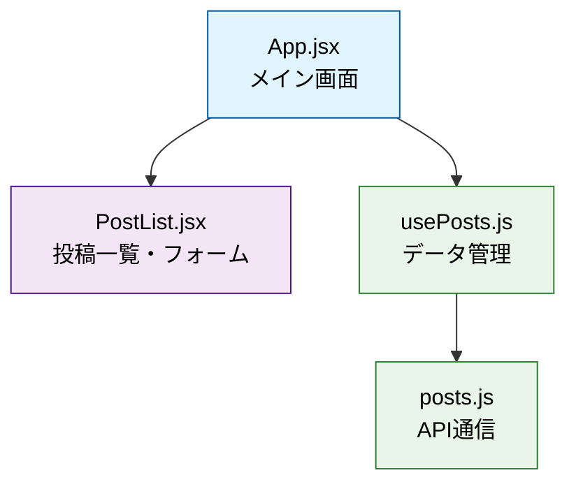
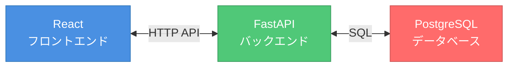
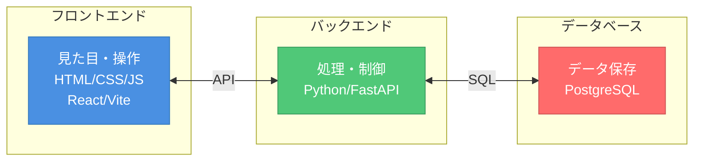
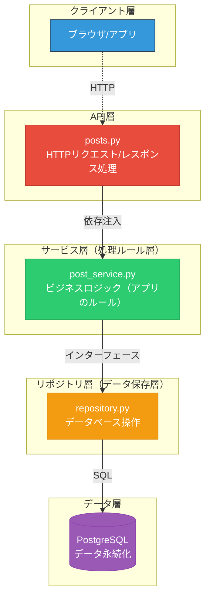
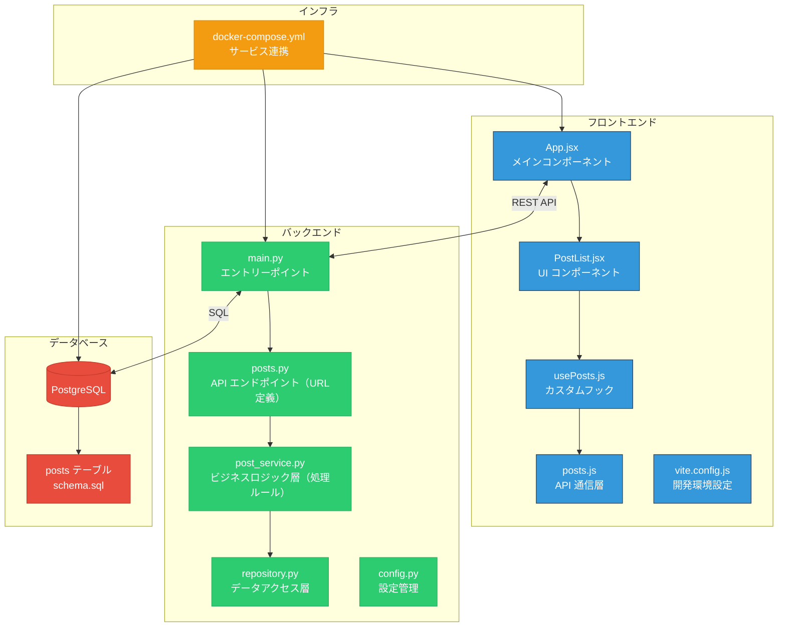
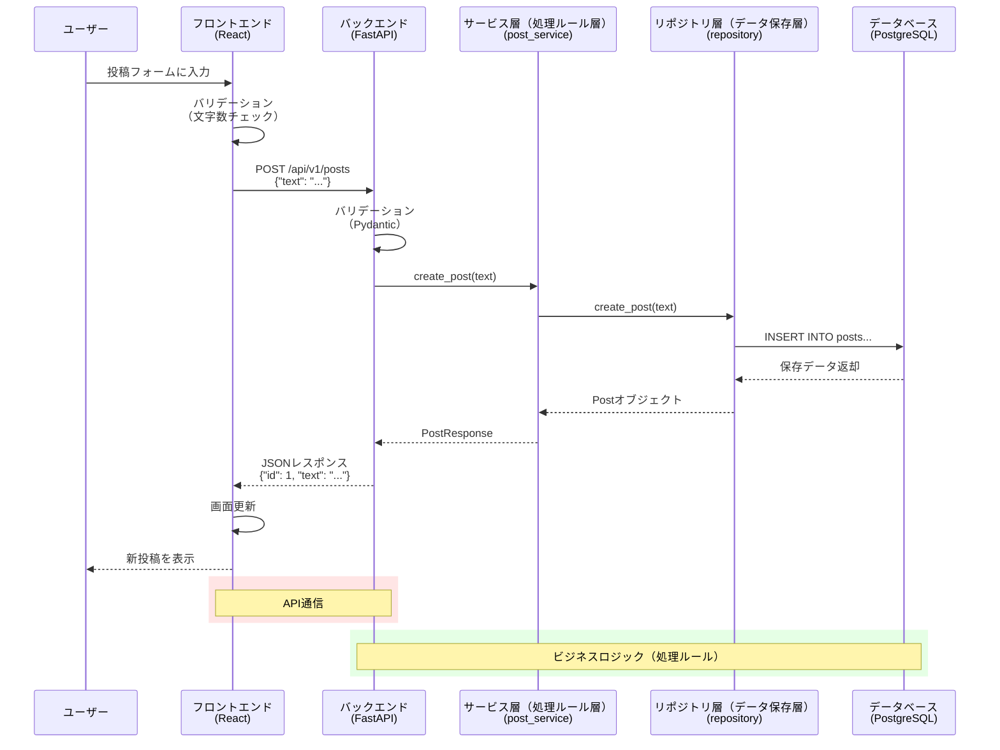
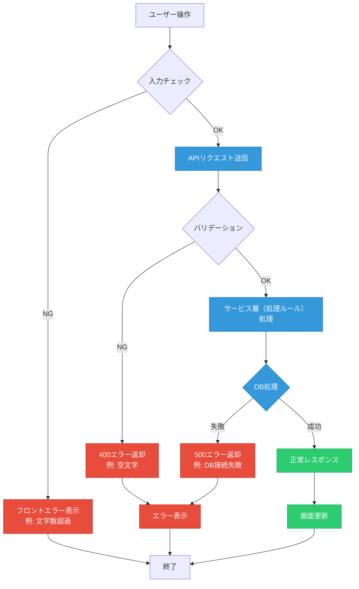

# Web開発入門講座 - アプリ開発を通じて学ぶ現代的な開発手法

> **目標**: フロントエンド・バックエンド・API・DB・SQLの基本概念を実践的に理解する

---

## 📚 講座の流れ

**⚠️ 初学者の方へ：まず「0.5 このプロジェクトのファイルマップ」を読んでから始めてください！**

1. **📁 このプロジェクトのファイルマップ**　← まずはここから！
2. **🌟 Web開発の全体像を知ろう**
3. **🚀 開発環境を動かしてみよう**
4. **🎨 フロントエンド（見た目）を理解しよう**
5. **⚙️ バックエンド（API）を理解しよう**
6. **🗄️ データベースとSQLを理解しよう**
7. **🔄 全体の仕組みを振り返ろう**
---

## 🗂️ 0.5 このプロジェクトのファイルマップ

### 📁 全体構造

まず最初に、このプロジェクトにはどんなファイルがあるのかを確認しましょう。

```
web-app-mvp/
├── 📁 client/              # フロントエンド（画面・UI）
│   ├── src/
│   │   ├── App.jsx         # ⭐️ メイン画面（最初に見るファイル）
│   │   ├── components/
│   │   │   └── PostList.jsx # ⭐️ 投稿一覧・投稿フォーム
│   │   ├── hooks/
│   │   │   └── usePosts.js  # ⭐️ データ管理ロジック
│   │   └── api/
│   │       └── posts.js     # ⭐️ サーバーとの通信
│   ├── package.json        # 🔧 使用ライブラリ一覧
│   └── vite.config.js      # 🔧 開発環境設定
├── 📁 server/              # バックエンド（処理・API）
│   ├── app/
│   │   ├── main.py         # ⭐️ サーバー起動ファイル（最初に見る）
│   │   ├── api/v1/
│   │   │   └── posts.py    # ⭐️ API定義（投稿の取得・作成）
│   │   ├── services/
│   │   │   └── post_service.py # ⭐️ ビジネスロジック（処理のルール・データの検証）
│   │   ├── db/
│   │   │   ├── repository.py # ⭐️ データベース操作
│   │   │   └── schema.sql   # ⭐️ テーブル定義
│   │   └── core/
│   │       ├── config.py   # 🔧 設定管理
│   │       └── logging.py  # 🔧 ログ設定
│   ├── requirements.txt    # 🔧 使用ライブラリ一覧
│   └── tests/
│       └── test_posts.py   # 🧪 テストコード
├── 📁 infra/              # インフラ（環境構築）
│   └── docker-compose.yml # 🔧 開発環境設定
├── Makefile               # 🔧 よく使うコマンド集
└── lecture-materials.md   # 📖 この資料
```

**記号の意味：**
- ⭐️ = **最重要ファイル**（必ず理解すべき）
- 🔧 = **設定ファイル**（最初は理解しなくてOK）
- 🧪 = **テストファイル**（余裕があれば見る）
- 📖 = **ドキュメント**

### 🎯 初学者向け：最初に読むべきファイルの順序

**迷った時はこの順序で読んでください！**

#### Phase 1: 全体の動きを理解（5分）
1. `client/src/App.jsx` の 19〜25行目 - 画面がどう作られているか
2. `client/src/components/PostList.jsx` の 15〜30行目 - ユーザー操作の処理

#### Phase 2: データの流れを理解（10分）
3. `client/src/hooks/usePosts.js` の 14〜25行目 - フロントでのデータ管理
4. `client/src/api/posts.js` の 8〜20行目 - サーバーとの通信方法

#### Phase 3: サーバー側を理解（10分）
5. `server/app/main.py` の 30〜40行目 - サーバーがどう起動するか
6. `server/app/api/v1/posts.py` の 32〜45行目 - APIがどう定義されるか

#### Phase 4: データベース（5分）
7. `server/app/db/schema.sql` の全体 - テーブル構造
8. `server/app/db/repository.py` の 48〜56行目 - SQL実行部分

### 🔗 ファイル間の関係図

#### フロントエンド内の関係


#### システム全体の関係


### 📊 ファイルの重要度

| 重要度 | ファイル | 説明 |
|--------|----------|------|
| 🔥 | `App.jsx`, `PostList.jsx` | 画面の見た目・機能を変更 |
| 🔥 | `posts.py`, `post_service.py` | API・ビジネスロジック（処理ルール）を変更 |
| ⚡ | `usePosts.js`, `posts.js` | データ管理ロジックを調整 |
| ⚡ | `repository.py`, `schema.sql` | データベース操作を変更 |
| 🔧 | `package.json`, `requirements.txt` | 新しいライブラリを追加 |
| 🔧 | `docker-compose.yml`, `Makefile` | 環境設定（初期設定のみ） |

### 💡 設定ファイル一覧（初学者は飛ばしてOK）

**これらのファイルは最初は理解しなくて大丈夫です：**

| ファイル | 役割 | いつ触る？ |
|----------|------|------------|
| `package.json` | フロントエンドで使うライブラリ一覧 | 新しいライブラリ追加時のみ |
| `requirements.txt` | バックエンドで使うライブラリ一覧 | 新しいライブラリ追加時のみ |
| `vite.config.js` | フロントエンドの開発サーバー設定 | 通常は触らない |
| `docker-compose.yml` | 開発環境の設定（DB、サーバー、フロント） | 通常は触らない |
| `Makefile` | よく使うコマンドの短縮形 | `make dev`で起動時のみ |
| `config.py`, `logging.py` | サーバーの細かい設定 | 通常は触らない |

**初学者へのアドバイス：**
- 最初は⭐️マークのファイルだけに集中しましょう
- 設定ファイル（🔧）は「あるんだな」程度の認識でOK
- 分からないファイルがあっても気にしないで進めましょう！

---

## 🌟 1. Web開発の全体像を知ろう

### Webアプリケーションって何？

普段使っているTwitter(X)、Instagram、YouTubeなどは全て「Webアプリケーション」です。これらはどのように動いているのでしょうか？

### 今回作るアプリ
簡単な投稿アプリを使って学びます：
- ✅ 投稿の一覧を見る
- ✅ 新しい投稿を追加する

### Web開発の3つの要素



### それぞれの役割

| 要素 | 役割 | 身近な例 |
|------|------|----------|
| **フロントエンド** | ユーザーが見る画面と操作 | スマホアプリの画面、ボタン |
| **バックエンド** | データ処理、ビジネスロジック（アプリのルール） | 「いいね」の数を計算する |
| **データベース** | データの保存と管理 | 投稿内容、ユーザー情報 |

### API（エーピーアイ）とは？
- **API** = Application Programming Interface
- フロントエンドとバックエンドをつなぐ「橋」
- 「投稿を取得」「新しい投稿を保存」などの**やり取り**をする仕組み

---

## 🚀 2. 開発環境を動かしてみよう (15分)

### 2.1 必要なツールの準備（Mac向け）

#### 2.1.1 Homebrewのインストール（未インストールの場合）

```bash
# Homebrewがインストール済みか確認
brew --version

# インストールされていない場合、以下を実行
/bin/bash -c "$(curl -fsSL https://raw.githubusercontent.com/Homebrew/install/HEAD/install.sh)"
```

#### 2.1.2 必要なツールのインストール

```bash
# Docker Desktop のインストール
brew install --cask docker

# makeは通常macOSに標準搭載されていますが、念のため確認
make --version

# makeがない場合（稀）
xcode-select --install
```

#### 2.1.3 Dockerの起動と確認

```bash
# Docker Desktop アプリを起動（Applications フォルダから、または）
open -a Docker

# Dockerが動作していることを確認
docker --version
docker-compose --version
docker ps
```

⚠️ **注意**: Docker Desktop の初回起動時は管理者権限が必要です。パスワード入力を求められた場合は入力してください。

### 2.2 必要なツールの概要

今回使用するツール：
- **Docker**: アプリを簡単に動かすためのツール
- **make**: コマンドを簡潔に実行するためのツール

### 2.2 アプリを起動してみよう

⚠️ **初回起動時の注意**
- 初回起動時はDockerイメージのダウンロードに時間がかかります（5-10分程度）
- データベースの初期化も自動で行われます

ターミナルで以下のコマンドを実行：

```bash
# 1. プロジェクトフォルダに移動
cd web-app-mvp

# 2. 開発環境を起動（初回は時間がかかります）
make dev

# もしポート競合エラーが出た場合
make dev-down  # 一度停止
make dev       # 再起動
```

### 2.3 動作確認

以下のURLにアクセスしてみましょう：

1. **フロントエンド（画面）**: http://localhost:5173
   - 投稿アプリの画面が表示される
   
2. **バックエンド（API）**: http://localhost:8000/docs
   - API の仕様書が表示される

3. **データベース**: localhost:5432
   - 直接は見えないが、データが保存されている

### 2.4 基本操作を試してみよう

1. 画面に「投稿内容を入力」欄があることを確認
2. 何か文字を入力して「投稿」ボタンを押す
3. 投稿が一覧に表示されることを確認

**🎯 ここで体験できること：**
- フロントエンド → バックエンド → データベースの連携
- リアルタイムでのデータ反映

---

## 🎨 3. フロントエンド（見た目）を理解しよう (35分)

### 3.1 フロントエンドの構成

```
client/
├── src/
│   ├── App.jsx          # ⭐️ メイン画面（まずここから読む）
│   ├── components/
│   │   └── PostList.jsx # ⭐️ 投稿一覧・投稿フォーム
│   ├── hooks/
│   │   └── usePosts.js  # ⭐️ データ管理ロジック
│   └── api/
│       └── posts.js     # ⭐️ サーバーとの通信
└── package.json         # 🔧 使用ライブラリ一覧（設定ファイル）
```

**💡 ヒント：**
- ⭐️マークのファイルから順番に読みましょう
- 🔧マークの設定ファイルは後回しでOK

### 3.2 React の基本概念

**React** = 画面を作るためのJavaScriptライブラリ

#### コンポーネント（部品）という考え方
```jsx
// PostList.jsx - 投稿一覧を表示する「部品」の簡略版
// 実際のコードにはフォームやエラーハンドリングも含まれています
function PostList({ posts }) {
  return (
    <div>
      <h2>投稿一覧</h2>
      <ul>
        {posts.map(post => (
          <li key={post.id}>
            {post.text} (ID: {post.id})
          </li>
        ))}
      </ul>
    </div>
  );
}
```

### 3.3 【実習1】フロントエンドを変更してみよう

#### 3.3.1 タイトルを変更
`client/src/App.jsx` を開いて、9行目のタイトル部分を変更：

```jsx
// 変更前（9行目）
<h1>FastAPI + React Posts App</h1>

// 変更後（好きなタイトルに変更）
<h1>私の投稿アプリ</h1>
```

#### 3.3.2 スタイルを追加
同じファイル（App.jsx）の8行目のdivタグのスタイルを変更：

```jsx
// 変更前（8行目）
<div style={{ padding: '20px' }}>

// 変更後
<div style={{ 
  padding: '20px', 
  backgroundColor: '#f5f5f5',  // 背景色を追加
  minHeight: '100vh'           // 高さを指定
}}>
```

#### 3.3.3 変更を確認
ブラウザが自動的に更新され、変更が反映されることを確認。ファイルを保存した瞬間にブラウザがリロードされます。

**🎯 学習ポイント：**
- コードを変更すると即座に画面に反映される（ホットリロード）
- JSX = HTMLとJavaScriptを組み合わせた書き方
- コンポーネント = 再利用可能な画面の部品

### 3.4 データの流れを理解しよう

#### 3.4.1 状態管理（useState）
```jsx
// usePosts.js より抜粋
const [posts, setPosts] = useState([]);  // 投稿リストの状態
const [loading, setLoading] = useState(true);  // 読み込み中の状態
```

#### 3.4.2 API通信（fetch）
```jsx
// posts.js より抜粋
export const postsApi = {
  async getAll() {
    const response = await fetch('/api/v1/posts');
    if (!response.ok) {
      throw new Error('Failed to fetch posts');
    }
    return response.json();
  }
};
```

### 3.5 【実習2】新しい機能を追加してみよう

投稿の文字数カウンター を追加してみましょう：

`client/src/components/PostList.jsx` を編集して、52行目のinput要素の直後に以下を追加：

```jsx
// 52行目の </> の後、53行目の <button> の前に追加
<div style={{ 
  color: text.length > 255 ? 'red' : 'gray', 
  fontSize: '12px',
  marginTop: '5px'
}}>
  {text.length}/255文字
</div>
```

**🎯 学習ポイント：**
- 条件分岐を使ったスタイル変更
- リアルタイムでの文字数表示
- ユーザビリティの向上

---

## ⚙️ 4. バックエンド（API）を理解しよう (35分)

### 4.1 バックエンドの構成

```
server/
├── app/
│   ├── main.py          # ⭐️ サーバー起動ファイル（まずここから読む）
│   ├── api/v1/
│   │   └── posts.py     # ⭐️ API定義（投稿の取得・作成）
│   ├── services/
│   │   └── post_service.py # ⭐️ ビジネスロジック（処理のルール・データの検証）
│   ├── db/
│   │   ├── repository.py # ⭐️ データベース操作
│   │   └── schema.sql   # ⭐️ テーブル定義
│   └── core/            # 🔧 設定ファイル（config.py, logging.py）
├── tests/               # 🧪 テストコード
└── requirements.txt     # 🔧 使用ライブラリ一覧（設定ファイル）
```

**💡 ヒント：**
- ⭐️マークのファイルから順番に読みましょう
- 🔧マークの設定ファイルは後回しでOK
- 🧪テストは余裕があれば見る

### 4.2 FastAPI の基本

**FastAPI** = PythonでAPIを作るためのフレームワーク

#### APIエンドポイント（URL）の定義

**エンドポイント** = APIにアクセスするためのURL（例：`/api/v1/posts`）
```python
# posts.py より抜粋（簡略版）
@router.get("/posts", response_model=List[PostResponse])
async def get_posts(
    post_service: PostService = Depends(get_post_service_dep)
):
    posts = await post_service.get_all_posts()
    return posts

@router.post("/posts", response_model=PostResponse)
async def create_post(
    post_data: PostCreate,
    post_service: PostService = Depends(get_post_service_dep)
):
    post = await post_service.create_post(post_data.text)
    return post
```

### 4.3 HTTPメソッドの理解

| メソッド | 用途 | 例 |
|----------|------|-----|
| **GET** | データを取得 | 投稿一覧を見る |
| **POST** | データを作成 | 新しい投稿を作る |
| **PUT** | データを更新 | 投稿を編集する |
| **DELETE** | データを削除 | 投稿を削除する |

### 4.4 【実習3】APIを直接触ってみよう

#### 4.4.1 API仕様書を見てみる
http://localhost:8000/docs にアクセス

- 「Swagger UI」という自動生成されたAPI仕様書
- 実際にAPIを試すことができる

#### 4.4.2 GETリクエストを試す
1. `GET /api/v1/posts` をクリック
2. 「Try it out」をクリック
3. 「Execute」をクリック
4. Response body に投稿データが表示される

#### 4.4.3 POSTリクエストを試す
1. `POST /api/v1/posts` をクリック
2. 「Try it out」をクリック  
3. Request body に以下を入力：
   ```json
   {
     "text": "APIから直接投稿しました！"
   }
   ```
4. 「Execute」をクリック
5. フロントエンドを更新して、投稿が追加されていることを確認

**🎯 学習ポイント：**
- APIは直接操作できる
- JSON形式でのデータ交換
- フロントエンドとバックエンドは独立している

### 4.5 【実習4】バリデーション（入力チェック）を理解しよう

#### 4.5.1 エラーを発生させてみる
API仕様書で以下を試してみましょう：

```json
{
  "text": ""
}
```

→ 400エラーが発生することを確認

#### 4.5.2 バリデーションコードを見てみる
```python
# posts.py より抜粋
class PostCreate(BaseModel):
    text: str = Field(..., min_length=1, max_length=255)
    # Fieldの...は必須フィールドを意味します
    # min_length=1: 最低1文字以上
    # max_length=255: 最大255文字まで
```

**🎯 学習ポイント：**
- サーバー側でのデータ検証
- エラーハンドリングの重要性
- ユーザーに分かりやすいエラーメッセージ

### 4.6 レイヤードアーキテクチャ（階層型設計）

**レイヤードアーキテクチャ** = プログラムを「層」に分けて整理する設計方法
**依存注入** = 必要な機能を外から渡す仕組み（部品の組み合わせ）
**インターフェース** = 異なる部品をつなぐ約束事・ルール



**なぜ分けるの？**
- **責任の分離**: 各層が専門的な役割を持つ
- **テストしやすい**: 各層を独立してテストできる
- **変更に強い**: 一つの層の変更が他に影響しにくい

---

## 🗄️ 5. データベースとSQLを理解しよう (25分)

### 5.1 データベースとは？

**データベース** = データを整理して保存する仕組み

#### テーブル構造
今回のアプリでは「posts」テーブルを使用：

```sql
CREATE TABLE posts (
    id SERIAL PRIMARY KEY,      -- 投稿ID（自動増加）
    text VARCHAR(255) NOT NULL, -- 投稿内容（1-255文字）
    created_at TIMESTAMP DEFAULT CURRENT_TIMESTAMP  -- 作成日時（自動設定）
);
```

### 5.2 SQLの基本

**SQL** = Structured Query Language（データベース操作言語）

#### よく使う4つの操作（CRUD）

| 操作 | SQL | 意味 |
|------|-----|------|
| **C**reate | INSERT | データを追加 |
| **R**ead | SELECT | データを取得 |  
| **U**pdate | UPDATE | データを更新 |
| **D**elete | DELETE | データを削除 |

### 5.3 【実習5】SQLを実際に書いてみよう

#### 5.3.1 データベースに接続
ターミナルで新しいウィンドウを開き：

```bash
# PostgreSQLコンテナに接続（プロジェクトディレクトリで実行）
docker-compose -f infra/docker-compose.yml exec db psql -U postgres -d app

# または、docker execを使う場合（コンテナ名は環境により異なる場合があります）
docker exec -it $(docker-compose -f infra/docker-compose.yml ps -q db) psql -U postgres -d app
```

#### 5.3.2 基本的なSQL文を実行

**1. 全投稿を取得**
```sql
SELECT * FROM posts;
```

**2. 特定の投稿を取得**
```sql
SELECT * FROM posts WHERE id = 1;
```

**3. 投稿数をカウント**
```sql
SELECT COUNT(*) FROM posts;
```

**4. 新しい投稿を追加**
```sql
INSERT INTO posts (text) VALUES ('SQLから直接追加しました！');
```

**5. 投稿を更新**
```sql
UPDATE posts SET text = '更新された投稿' WHERE id = 1;
```

**6. 投稿を削除（注意：元に戻せません）**
```sql
DELETE FROM posts WHERE id = 1;
```

### 5.4 【実習6】複雑なクエリに挑戦

#### 5.4.1 条件を指定した検索
```sql
-- 10文字以上の投稿を検索
SELECT * FROM posts WHERE LENGTH(text) >= 10;

-- 最新の3件を取得（新しい順）
SELECT * FROM posts ORDER BY created_at DESC LIMIT 3;
```

#### 5.4.2 集計関数
```sql
-- 投稿の平均文字数
SELECT AVG(LENGTH(text)) as avg_length FROM posts;

-- 最も長い投稿
SELECT text, LENGTH(text) as length 
FROM posts 
ORDER BY LENGTH(text) DESC 
LIMIT 1;
```

**🎯 学習ポイント：**
- SQLは日本語に近い書き方
- データの検索・集計が柔軟にできる
- データベースの操作はアプリから独立している

### 5.5 コードでのSQL使用例

```python
# repository.py より抜粋
async def get_all_posts(self) -> List[Dict]:
    if not self.pool:
        raise RuntimeError("Database pool not initialized")
    
    async with self.pool.acquire() as conn:
        rows = await conn.fetch(
            "SELECT id, text, created_at FROM posts ORDER BY id DESC"
        )
        return [dict(row) for row in rows]
```

**SQLインジェクション対策**
```python
# ❌ 危険：直接文字列結合
query = f"SELECT * FROM posts WHERE text = '{user_input}'"
# 悪意ある入力例: "'; DROP TABLE posts; --"

# ✅ 安全：プレースホルダー使用
query = "SELECT * FROM posts WHERE text = $1"
rows = await conn.fetch(query, user_input)
# プレースホルダーが自動でエスケープ処理
```

---

## 🔄 6. 全体の仕組みを振り返ろう (20分)

### 6.1 システム全体のアーキテクチャ



### 6.1 データの流れを追ってみよう

新しい投稿を作成する場合の流れ：



### 6.2 【実習7】エラーハンドリングを確認しよう

#### 6.2.1 バリデーションエラー



**実際に試してみよう：**

1. **空文字での投稿**
   - 投稿フォームに何も入力せずに「投稿」ボタンを押す
   - 「テキストを入力してください」エラーが表示される

2. **256文字以上での投稿**
   - 以下の長いテキストをコピー&ペーストして投稿
   ```
   ああああああああああああああああああああああああああああああああああああああああああああああああああああああああああああああああああああああああああああああああああああああああああああああああああああああああああああああああああああああああああああああああああああああああああああああああああああああああああああああああああああああああああああああああああああああああああああああああああああああああああああああ
   ```
   - 文字数カウンターが255文字を超えて赤色に変わる
   - 「テキストは255文字以内で入力してください」エラーが表示される

#### 6.2.2 ネットワークエラー
1. **データベース停止による影響確認**
   ```bash
   # データベースコンテナ名を確認
   docker ps --filter name=db
   
   # データベースを停止
   docker-compose -f infra/docker-compose.yml stop db
   ```
2. フロントエンドで投稿を試行
3. エラーメッセージを確認
4. **データベースを再開**
   ```bash
   docker-compose -f infra/docker-compose.yml start db
   ```
   
**⚠️ 注意**: 必ずデータベースを再開してください。停止したままだと以降の実習ができません。

**🎯 学習ポイント：**
- 各層でのエラー処理の重要性
- ユーザーへの適切なフィードバック

### 6.3 【実習8】ログを見てみよう

ターミナルでdocker-composeを実行している画面を見てみましょう：

```
web-app-mvp-server-1  | INFO - Retrieved 3 posts
web-app-mvp-server-1  | INFO - Created post with id: 4
web-app-mvp-db-1      | LOG: statement: INSERT INTO posts (text) VALUES ($1) RETURNING id, text, created_at
```

**🎯 学習ポイント：**
- アプリケーションの動作がログで確認できる
- デバッグやトラブルシューティングに重要

### 6.4 開発でよく使うツール

| ツール | 用途 | 今回の例 |
|--------|------|----------|
| **Git** | バージョン管理 | コード変更履歴の管理 |
| **Docker** | 環境構築 | 開発環境の統一 |
| **API仕様書** | API文書化 | Swagger UI |
| **テスト** | 品質保証 | pytest |
| **ログ** | 動作確認 | アプリケーションログ |

### 6.5 今日学んだことのまとめ

#### 技術要素
- ✅ **フロントエンド**: React, JavaScript, HTML/CSS
- ✅ **バックエンド**: Python, FastAPI, API設計
- ✅ **データベース**: PostgreSQL, SQL
- ✅ **インフラ**: Docker, 環境構築

#### 重要な概念
- ✅ **分離の原則**: フロント・バック・DBの役割分担
- ✅ **API**: 異なるシステム間の通信方法
- ✅ **CRUD**: データ操作の基本パターン
- ✅ **バリデーション**: データの検証
- ✅ **エラーハンドリング**: 例外処理の重要性

#### 実践的スキル
- ✅ 実際のWebアプリケーションを動かした
- ✅ コードを変更して動作を確認した
- ✅ APIを直接操作した
- ✅ SQLでデータベースを操作した
- ✅ ログやエラーメッセージを読んだ


## 🎯 最後に

今日の講座で、Webアプリケーション開発の「全体像」を体験できました。

**重要なのは**：
- 🧩 **各技術がどう組み合わさっているか**
- 🔄 **データがどう流れているか**  
- 🛠️ **実際に手を動かして試すこと**

完璧に理解する必要はありません。まずは「こういう仕組みなんだな」という感覚を掴むことが大切です。

**プログラミングは継続が重要**です。小さなプロジェクトから始めて、少しずつスキルアップしていきましょう！

---

## 📁 理解度チェック：重要ファイルを再確認

講座を終えたら、以下のファイルを改めて見直してみましょう：

### ✅ 必ず理解すべきファイル（⭐️）
- [ ] `client/src/App.jsx` - React コンポーネントの基本
- [ ] `client/src/components/PostList.jsx` - UIコンポーネントの作り方
- [ ] `client/src/hooks/usePosts.js` - データ管理の仕組み
- [ ] `client/src/api/posts.js` - API通信の基本
- [ ] `server/app/main.py` - サーバー起動の仕組み
- [ ] `server/app/api/v1/posts.py` - API定義の書き方
- [ ] `server/app/services/post_service.py` - ビジネスロジック（処理ルール）の分離
- [ ] `server/app/db/repository.py` - データベース操作
- [ ] `server/app/db/schema.sql` - テーブル設計

### 💡 余裕があれば理解したいファイル（🔧）
- [ ] `client/vite.config.js` - フロントエンド開発環境設定
- [ ] `infra/docker-compose.yml` - 開発環境の構築
- [ ] `Makefile` - よく使うコマンドの自動化

**🎯 学習のゴール：**
上記のファイルを見て「このファイルは何をしているか」が説明できるようになること！

---

## 📝 課題（持ち帰り）

理解度チェックが完了したら、以下の機能追加に挑戦してみてください：

### 🔰 初級課題（重要ファイルの変更を練習）
1. **投稿の削除機能**を追加
   - 変更ファイル：`PostList.jsx`, `posts.py`, `post_service.py`, `repository.py`
2. **投稿の編集機能**を追加  
   - 変更ファイル：`PostList.jsx`, `posts.py`, `post_service.py`, `repository.py`
3. **文字数制限の変更**（255文字 → 500文字）
   - 変更ファイル：`PostList.jsx`, `posts.py`, `schema.sql`

### 🔥 中級課題（新機能の追加を練習）
1. **投稿の検索機能**を追加（LIKE演算子を使用）
2. **投稿者名**フィールドを追加（DBスキーマ変更含む）
3. **投稿のソート機能**（日付順、文字数順など）

### 🚀 上級課題（アーキテクチャの拡張）
1. **ページング機能**（大量データ対応）
2. **リアルタイム更新**（WebSocket使用）
3. **ユーザー認証機能**の追加

**💡 課題のヒント：**
- 各課題で「どのファイルを変更する必要があるか」を考えてから実装
- 困った時は「0.5 ファイルマップ」に戻って構造を確認
- 一つずつ小さく実装して動作確認することが大切

頑張って挑戦してみてください！🎉
